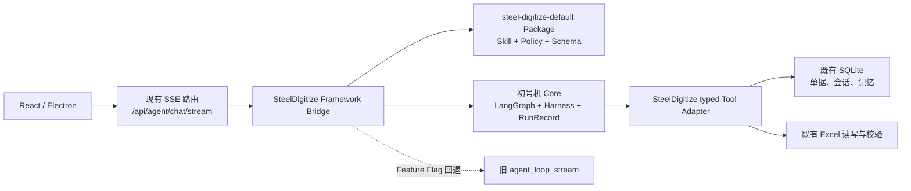

# SteelDigitize Agent Core 迁移设计与清单

> 状态：设计评审稿，未实施。
> 范围：以 Enterprise Agent Framework（下称“初号机 Core”）替换 SteelDigitize 的旧 Agent Loop；不重写 SteelDigitize 产品。
> 本文不授权切换流量、外发业务数据或调用真实模型。

## 1. 目标、非目标与完成定义

### 1.1 目标

在不改变用户聊天入口、会话数据、SQLite 单据数据和 Excel 业务逻辑的前提下，以初号机 Core 接管以下横切职责：

- 模型的 `final` / typed `tool_call` 编排；
- Tool 的输入、输出 Schema 与允许清单；
- 读写权限、审批、幂等、执行事实与错误事实；
- `thread_id` 持久化、RunRecord 审计及确定性验收；
- Package/Skill 的版本化和可回退发布。

### 1.2 非目标

- 不重写 React/Electron、单据管理、设置、上传和 Excel 实现。
- 不删除旧 `backend/agent.py` Loop、历史消息或现有 SQLite 表。
- 不把“已有 knowledge 路径”表述为已具备检索/RAG 能力；首期不建设新的知识库。
- 不把初号机当前的本地 CLI/Python API 伪装为 HTTP 平台、MCP 服务或生产多租户后台。
- 不因接入而调用真实模型。真实模型验证必须单独披露发送目标、内容范围并取得授权。

### 1.3 完成定义

切换完成不是“新代码能跑”，而是同时满足：

1. `/api/agent/chat/stream` 的请求、SSE 事件类型和前端落库流程兼容；
2. 同一 SteelDigitize 回归集下，新旧路径的只读、写入、校验、失败和会话行为符合预期；
3. 新路径的成功结论只能来自 ToolResult、`evidence_id`、输出校验和 RunRecord；
4. 线上可用特性开关在同一版本中切回旧 Loop；
5. 写操作的审批交互已真正接通，或写 Tool 尚未切入新路径。

## 2. 已核对的当前事实

当前线上调用链：

```text
frontend/src/hooks/useAgentChat.ts
  -> POST /api/agent/chat/stream
  -> backend/routers/agent_chat.py
  -> backend/agent.py::agent_loop_stream
  -> DeepSeek Function Calling + SQLite / Excel / Memory / Session / Skill Harness
```

- 前端已消费 `stage`、`tool_call`、`tool_result`、`delta`、`done`、`error` 六类 SSE 事件，并在 `done` 后由前端写入现有 `chat_messages`。
- 路由目前直接导入旧 Loop。替换点只能在路由之后、业务函数之前；首期不改前端请求格式。
- `backend/agent.py` 的业务 Tool 有 12 个：单据查询/明细、Excel 查行/新建/写入/导出/校验、Memory 读写、会话检索、设置读取、时间读取。
- `agent_runtime.py`、`memory_harness.py`、`session_harness.py`、`response_harness.py` 已包含值得复用的事实型校验；但 `get_enabled_skills()` 的触发词匹配属于旧的语义路由，不能迁入新 Core。
- 初号机 Core 已实现 PackageLoader、typed Tool、Policy、审批 interrupt/resume、SQLite checkpoint 和 JSONL RunRecord；当前模型适配器为**非流式**，HTTP/MCP Tool 执行器仍未实现。

## 3. 目标架构



这里的“Bridge（桥接层）”是一个适配器（Adapter）：它只负责把旧 SSE/会话接口翻译为新 Core 的 Task、事件和结果，不能承载业务判断或绕过 Policy。

### 3.1 模块职责

| 模块 | 新职责 | 不承担的职责 |
|---|---|---|
| `backend/routers/agent_chat.py` | 维持 HTTP/SSE 契约，选择旧/新入口 | 不解析模型动作、不直接执行 Tool |
| `backend/steel_agent/bridge.py` | 构建 Task、调用 Core、翻译事件、生成前端 trace | 不实现 SQLite/Excel 业务 |
| `backend/steel_agent/package/` | 默认 Package、Skill、Policy、Schema、版本 | 不存放 API Key 或客户数据 |
| `backend/steel_agent/tools/` | 注册 typed ToolSpec 与 handler | 不重复实现 `database.py` / `spreadsheet.py` |
| 初号机 Core | 编排、Schema、Policy、审批、证据、RunRecord | 不理解 SteelDigitize 的业务细节 |
| 旧 `backend/agent.py` | 回退路径；逐步抽离原有 handler | 切换后不再是主编排器 |

## 4. 契约设计

### 4.1 入口 Task 与身份

第一阶段采用稳定的一对一映射：

| SteelDigitize 输入 | Core TaskContext | 规则 |
|---|---|---|
| `session_id` | `thread_id` | 使用相同 UUID；空值由 Bridge 生成任务专用 thread，不修改旧会话表 |
| 当轮请求 UUID | `task_id` | 每次 SSE 请求新建；写入 trace 但不替代 `session_id` |
| 本地桌面用户 | `user_id` | 首期使用受控本地身份；多用户/IAM 后续单列项目 |
| 固定产品包 | `tenant_id/package_id` | `steeldigitize-local` / `steel-digitize-default`，常量集中配置 |
| 用户消息、已选单据、上传路径 | `input` | 仅提供给当前 Skill 的输入 Schema 定义字段 |

`session_id -> thread_id` 是兼容映射，不代表把现有聊天记录复制到 Core checkpoint。聊天记录仍由现有 `chat_messages` 保存；Core 的 SQLite 状态库与 RunRecord 为新增、独立的审计状态。

### 4.2 SSE 兼容契约

| 现有事件 | Bridge 触发时机 | 约束 |
|---|---|---|
| `stage` | 加载 Package、模型请求、审批等待、结果整理 | 仅公开可展示阶段，不发送 Chain of Thought |
| `tool_call` | Core 接受模型的已验证 ToolCall | `args` 需经过脱敏；风险取自 ToolSpec |
| `tool_result` | Policy deny/approval 或 ToolExecutor 返回 | `ok` 仅由真实 ToolResult 决定；拒绝/待审批须 `blocked: true` |
| `delta` | 当前非流式 Core 返回最终文本后 | 首期可一次性发送完整文本，不能伪造逐 token 流式输出 |
| `done` | Core 终态为成功、失败或已回答 | 携带兼容 `reply`、`history`、`audit`；新增字段只能向后兼容 |
| `error` | Package 加载、模型、系统级未处理错误 | 不泄漏密钥、完整路径或内部堆栈 |

首期“非流式 `delta`”不需要改前端：现有前端将内容排队展示。若未来需要真正逐 token 输出，应作为 Core `StreamingModelAdapter` 独立变更和回归项，不能在 Bridge 中模拟模型流。

### 4.3 终态与前端 trace

Bridge 将 RunRecord 的事实摘要映射为前端已有 `audit`：Tool 数、风险、成功/拒绝/失败、`run_id`、RunRecord 相对标识和耗时。不得将 Tool 参数、绝对文件路径、记忆全文、模型原始消息或秘密写入 trace。

当写 Tool 因审批暂停时，首期 SSE 必须返回明确的 `tool_result(blocked=true)` 与“待确认，未执行”的 `done`。真正使用初号机 `resume_approval()` 的断点恢复，需要新增审批 ID、批准/拒绝入口和 UI；在它实现前，不能把写 Tool 切到新生产路径。

## 5. Tool Adapter 迁移清单

### 5.1 统一 ToolSpec 要求

每个 Adapter 必须声明并通过测试：

- `name`、业务描述、JSON Schema 输入/输出；
- 风险等级、所需权限、超时、幂等性、可执行种类；
- handler 对现有业务函数的最小调用；
- 成功证据（`evidence_id` 的来源）和失败标准化；
- 写后验证、重复调用、权限拒绝、异常与超时用例。

这就是“契约（Contract）”：调用者和实现之间可机器校验的输入、输出与边界，不是写在 Prompt 里的约定。

### 5.2 Tool 分组与迁移顺序

| 批次 | 旧 Tool | 新 Tool 风险/策略 | 证据与关键事实 |
|---|---|---|---|
| R1 只读 | `db_lookup_receipt`、`db_get_receipt_items` | read / allow | 查询条件摘要、返回条数、结果哈希 |
| R2 上下文 | `settings_read`、`runtime_now`、`session_search`、`memory_list` | read / allow | 配置状态、时间、命中数、Memory revision；敏感字段脱敏 |
| W1 文件前置 | `spreadsheet_find_last_row`、`spreadsheet_verify` | read / allow | 文件/Sheet 存在、行号、校验结果；路径不进前端 trace |
| W2 文件写入 | `spreadsheet_create_new`、`spreadsheet_write_batch`、`spreadsheet_export_receipts` | write / require_approval | idempotency key、文件元数据、写后 `verify_batch`、单据 ID、校验摘要 |
| W3 Memory | `memory_replace` | write / require_approval | 读取 revision、CAS 成功、脱敏内容哈希、新 revision |

具体约束不能退化：

- Excel 创建仍不能为不存在的 `WORK_DIR` 自动创建父目录；应返回“工作目录不存在”的事实失败。
- `spreadsheet_export_receipts` 必须继续由数据库读取已选单据，批量同 Sheet 保持原子调用；成功必须包含写后校验。
- `memory_replace` 必须先 `memory_list` 取得 revision，再使用 compare-and-swap 写入；删除/改写内容需审批。
- `session_search` 默认只搜当前 `thread_id/session_id`；跨会话查询需明确 Scope，不能由 Prompt 扩权。

### 5.3 Adapter 形态（伪接口）

```python
def export_receipts_handler(call: ToolCall, context: TaskContext) -> dict:
    # 1) Core 已完成 Schema 与 Policy 前置检查；handler 不猜测用户意图。
    # 2) 调用既有 database.get_receipts_for_export / spreadsheet.export_receipts。
    # 3) 返回规范化业务结果；ToolExecutor 负责 output schema、evidence 与幂等持久化。
    ...
```

禁止从 handler 调用旧 `AgentRunState.authorize()` 形成两套权限真相。迁移时应把其事实校验拆为 Schema、Policy 或 handler 内的确定性业务校验，并逐项测试。

## 6. Skill、Package 与 Policy 迁移

### 6.1 `steel-digitize-default` Package

建议目录：`backend/steel_agent/package/steel-digitize-default/`。首个 Package 固定版本、可离线加载，包含：

- `package.yaml`：identity、Tool allowlist、Policy、记录模式、模型环境变量名、`max_steps`；
- `skills/*.md`：YAML front matter + Markdown 指令；
- `schemas/`：复用或引用的输入/输出 JSON Schema；
- `README.md`：能力、非能力、数据外发边界和回退版本。

首期 Skill 可按任务，而非用户关键词，划分为：`receipt_query`、`receipt_export`、`workspace_context`、`memory_management`。Skill 的选择要来自请求显式 `skill_id`、产品操作上下文或模型在受限清单中的选择；不得重新引入 `triggers` 字符串/中文正则来决定意图。

### 6.2 旧 Skill 数据的处理

现有 SQLite Skill 形态为 `name/description/prompt/system_instruction/triggers`。迁移程序只能生成“待补全草稿”，不可直接启用。每条 Skill 在启用前必须补齐：

| 必填项 | 迁移规则 |
|---|---|
| `skill_id`、`version`、`name` | 新稳定 ID；旧数据库 ID 仅保存为来源元数据 |
| `input_contract` | 从真实 UI/Tool 输入反推 JSON Schema，不以 Prompt 描述代替 |
| `output_contract` | 明确文本、表格摘要或结构化结果；可被 JSON Schema 验证 |
| `allowed_tools` | 显式选取 Package Tool 的子集，不得由正文授予 |
| `validator`、正负例 | 至少覆盖成功、失败/拒绝、无 Tool 情形 |
| `owner`、状态 | draft/reviewed/enabled/retired 与回滚版本 |

### 6.3 默认策略

| 资源类别 | 默认 Policy | 说明 |
|---|---|---|
| 单据、设置、时间、会话、Memory 读取 | allow，最小 Scope | 返回必要字段，按记录策略脱敏 |
| Excel 新建、写入、导出 | require_approval | approval 前不可执行，恢复必须使用同一 thread/task/call |
| Memory 修改 | require_approval | 保留 revision 与变更摘要，禁止明文秘密进入审计 |
| 未注册 Tool、无 Scope、无效 Schema | deny | 生成不可执行的事实结果，模型可据此说明原因 |

Policy 与 Schema 只约束事实和权限，不应由中文关键词或正则替模型做语义选择。

## 7. 初号机 Core 的交付方式与状态存储

初号机当前目录没有可读取 Git 提交元数据，实施前必须完成以下 G0 决策，不能静默复制“最新版”：

1. 冻结一个经审阅的 Core 源码快照，记录目录清单、`pyproject.toml` 版本、依赖锁与内容哈希；
2. 决定以受控 vendoring、私有包仓库或可审计 Git 仓库引入；当前建议优先 vendoring 到 SteelDigitize 可追踪目录，因为尚无可引用的发布制品；
3. 明确 Core 依赖与 SteelDigitize 后端虚拟环境的兼容矩阵，尤其是 Pydantic、LangGraph、SQLite 依赖；
4. Core checkpoint DB、RunRecord JSONL 与现有业务 `data.db` 分开存放；都不得提交版本库；
5. 记录模式首期使用 redacted/summary，禁止明文 Tool 参数、上传文件内容和 API Key 进入 RunRecord。

该部分属于供应链与运行时治理，不是业务 Bridge 可以绕过的细节。

## 8. 分阶段实施计划与阶段门

| 阶段 | 交付内容 | 不做什么 | 通过门 |
|---|---|---|---|
| P0 设计冻结 | 本文、Core 快照决策、数据流与权限矩阵 | 不导入依赖、不调用模型 | G0/G1 评审通过 |
| P1 最小 Bridge | Core 引入、PackageLoader、Task 映射、SSE 事件翻译、Feature Flag | 不接业务 Tool、不切流量 | Fake Model 下请求到 `done`，旧路径无改动 |
| P2 只读纵切 | R1/R2 Adapter、只读 Skill、RunRecord、双路径回归 | 不注册任何写 Tool | Schema/权限/会话/错误回归通过 |
| P3 影子比对 | 对同一脱敏/获准用例跑旧/新只读路径，记录差异 | 不把影子结果展示给终端用户 | 差异分类清楚，无越权/数据泄漏 |
| P4 写入闭环 | W1/W2/W3、审批 API/UI、resume、幂等与回滚演练 | 不删除旧 Loop | 写前不执行、批准后一次执行、拒绝零写入 |
| P5 小流量切换 | Feature Flag 指向新 Bridge，旧 Loop 即时可回退 | 不清理旧路径 | 业务回归、观测、回退演练通过 |
| P6 稳定后治理 | 发布说明、历史兼容、旧 Loop 清理提案 | 不自动删除旧代码/数据 | 另行批准清理范围 |

“特性开关（Feature Flag）”指可以在不重新发版的情况下选择旧/新执行入口的受控配置。它是本迁移的回退机制，默认值必须为旧 Loop，且要在启动时记录实际选中的入口。

## 9. 回归与验收矩阵

每个用例必须在报告中标明执行入口、Package 版本、Core 快照、模型类型、是否 synthetic，以及 RunRecord/旧 audit 标识。

| 类别 | 代表用例 | 旧/新比对要点 |
|---|---|---|
| 单据查询 | 单号、日期、状态、空结果、非法参数 | 返回范围、Schema 拒绝、无 Tool 幻觉 |
| 会话/上下文 | 当前会话、跨会话拒绝、历史摘要 | `session_id/thread_id` 对应、数据不丢失 |
| 设置/时间 | 工作目录存在/不存在、当前时间 | 不凭提示词捏造事实 |
| Excel | 新建、追加、批量导出、Sheet 非法、文件锁、校验失败 | 不自动建缺失目录；成功必有验证 |
| Memory | 读、revision 冲突、敏感文本、删除未批准 | CAS、脱敏、审批和审计正确 |
| Policy | 未注册 Tool、无 Scope、拒绝、批准、重启恢复 | 无执行、一次执行、可解释终态 |
| SSE/UI | 六类事件、一次性 delta、done/error、中止 | 前端可用、无重复落库、无路径泄漏 |
| 回退 | Flag 切回旧 Loop | 同版本恢复现有聊天能力 |

验证证据必须分层报告：

1. **确定性框架/Adapter 测试**：证明契约、Policy、Schema、幂等、RunRecord；
2. **SteelDigitize 业务回归**：证明 SQLite/Excel/会话业务结果；
3. **真实模型 on synthetic 或脱敏材料**：仅在授权后验证模型选择 Tool/输出合约；
4. **真实客户验收**：需客户授权数据、环境、批准人和明确金标，不可由前三者替代。

## 10. 关键风险、阻断项与决策记录

| ID | 风险或未知项 | 默认处理 | 需要确认/完成后才能推进 |
|---|---|---|---|
| D1 | Core 引入方式与依赖兼容 | 停在 P0；不复制未冻结源码 | 依赖来源、版本、许可证/供应链审阅 |
| D2 | 模型服务与数据外发 | Fake Model/离线测试 | endpoint、模型、发送字段、授权人 |
| D3 | 写操作审批体验 | 写 Tool 不切换 | UI/API、approver 身份、超时、拒绝、resume |
| D4 | 旧 Skill 如何选择 | 只迁移显式审阅的 default Skills | 选择机制、owner、Schema、测试例 |
| D5 | RunRecord 位置与保留期 | redacted/summary、独立目录 | 访问权限、备份、清理与审计责任 |
| D6 | 真实流式体验 | 一次性 `delta` | 是否立项 StreamingModelAdapter |
| D7 | 多用户/tenant | 本地单租户常量，不假设 IAM | 身份来源、Scope 映射、隔离要求 |

## 11. 实施前检查清单

- [ ] 当前工作区的既有未提交变更已确认，不被本迁移覆盖。
- [ ] P0 的 Core 快照、依赖锁、安装方式与存储路径已书面确认。
- [ ] Package ID、默认 Skill、Tool 清单、Policy 及记录模式已审阅。
- [ ] 前端无需修改的 SSE 兼容样例已固化为自动化测试。
- [ ] 只读 Tool 的 Schema、输出脱敏与失败契约已完成。
- [ ] 写 Tool 的审批/恢复 UX 尚未完成前，Feature Flag 不允许其走新路径。
- [ ] 旧 Loop 回退开关、观测字段和一键回退演练已准备。
- [ ] 真实模型或真实业务数据的外发授权仍为空；未得到授权前只执行 Fake/离线验证。

## 12. 下一步建议

按 P0 执行一次“设计冻结评审”：确认 D1（Core 引入方式）、D3（审批交互边界）、D5（RunRecord 存储）三项。确认后，实施仅从 P1 的 Fake Model 最小 Bridge 开始；不跳过只读纵切直接迁移 Excel 写入。
