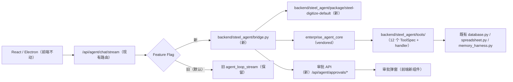

# SteelDigitize Agent 替换初号机 Core —— 执行方案（Codex 交付版）

> 状态：**已拍板，待执行**（2026-08-13）
> 执行者：Codex（本文件为完整自包含执行说明书）
> 任务一句话：用「初号机 Enterprise Agent Framework」替换 SteelDigitize 当前的旧 Agent Loop，SteelDigitize 成为初号机的第一个真实 Package（引擎 + 配置多租户模式的试点），**全部工具切换（含 Excel 写入）并新增审批弹窗 UI**，保留旧 Loop 可随时回退。

---

## 执行者速览（先读这 5 句）

1. 你是 Codex，工作目录是 SteelDigitize 仓库（`/Users/libaodian/Desktop/工作区/SteelDigitize-github`）。任务是把仓库里旧的 Agent 引擎换成"初号机"引擎，本文件是唯一必读的执行说明书。
2. 旧引擎在 `backend/agent.py`（**保留不删**，作为回退路径）。新引擎从 `/Users/libaodian/Desktop/初号机agent/enterprise-agent-framework` 受控复制进 `backend/vendor/enterprise_agent_core/`（只复制 §5 P0 列的内容，不复制垃圾文件）。
3. 你要新建的代码都在 `backend/steel_agent/`：桥接层 bridge.py、12 个工具注册、Package 配置（含 4 个 Skill）。前端只加一个审批弹窗组件 + 小改一个 hook。
4. 按 §5 的 P0→P6 顺序执行，**每步验收门不过不进下一步**。全部完成后跑 §10 验收矩阵并报告。
5. 卡住时：先读 §5 对应步骤和 §11 禁区清单；仍无法解决就停下来报告问题，不要自行改方案、不要删除旧代码、不要编造测试结果。

---

## 启动指令（老板复制给 Codex 用）

> 请阅读并执行 `/Users/libaodian/Desktop/工作区/SteelDigitize-github/docs/SteelDigitize-初号机替换执行方案.md`。这是已拍板的 Agent 引擎替换任务：用初号机 Core 替换旧 Agent Loop，全部工具切换（含 Excel 写入），新增审批弹窗 UI，保留旧 Loop 可回退。按文档 P0→P6 顺序执行，每步完成验收门再进入下一步，完成后按 §10 验收矩阵报告结果。

---

## 0. 三份已拍板决策（不可更改）

1. **全部一次切换**：读工具 + 写工具（Excel 新建/写入/导出、Memory 修改）全部切入新路径，同时开发**审批弹窗 UI**。写操作必须先弹窗批准后执行。
2. **受控 vendoring**：初号机 Core 以受控方式引入 `backend/vendor/enterprise_agent_core/`（**不是原样复制整个初号机目录**）。只纳入：`src/` 核心代码、`pyproject.toml`、`requirements.lock`、`constraints/base.txt`、版本号与内容哈希记录。**不纳入**：`.venv`、`__pycache__`、历史测评报告、临时运行数据、示例租户包。
3. **旧 Loop 不删**：`backend/agent.py`、`backend/routers/agent_chat.py` 的旧路径完整保留，Feature Flag 默认指向旧 Loop，可一键回退。

## 1. 背景与商业目标

- 初号机 = 通用企业 Agent 引擎（Harness：身份、Schema、权限审批、执行事实、审计）。Package = 每个客户/项目的内容包（Skill 指令、工具清单、权限策略、模型配置）。
- SteelDigitize 是第一个试点：把现有 12 个业务工具、会话体系、Excel 能力打包成 `steel-digitize-default` Package 跑在初号机上，验证"一个引擎卖多家"的模式。
- 迁移只换 Agent 引擎，**不重写产品**：前端、单据管理、OCR、Excel 业务逻辑全部不动。

## 2. 可选参考文档（按需查阅，非必读；本文件已自包含）

| 文档 | 路径 | 用途 |
|---|---|---|
| 三篇初号机说明书（md 版，Codex 可直接读） | `docs/初号机说明书/01-代码模块与文件说明书.md`、`02-平台架构与定制边界.md`、`03-客户定制接口与需求转译规范.md`（仓库内） | 引擎能力、四类定制边界、交付规范 |
| 迁移设计与清单（本方案的背景设计稿） | `docs/SteelDigitize-Agent-Core-迁移设计与清单.md`（仓库内） | 背景、风险 D1–D7、回归矩阵 |
| 初号机 README | `/Users/libaodian/Desktop/初号机agent/enterprise-agent-framework/README.md` | Core 能力与边界 |
| 初号机契约（PackageManifest 字段，**以代码为准**） | `/Users/libaodian/Desktop/初号机agent/enterprise-agent-framework/src/enterprise_agent/contracts/package.py` | package.yaml 字段定义 |
| package.yaml / Skill 模板 | 见本文件 **附录 A、附录 B**（已内嵌完整示例） | 直接照抄改字段 |

## 3. 现状事实（代码地图）

### 3.1 SteelDigitize 后端（FastAPI + SQLite + Excel）

| 文件 | 行数 | 职责 | 迁移动作 |
|---|---|---|---|
| `backend/agent.py` | 864 | 旧 Agent Loop：`agent_loop_stream` / `agent_loop`、TOOLS 定义、`execute_tool` | **保留**（回退路径）；工具 schema 从 `TOOLS` / `EXPORT_RECEIPTS_TOOL` 抄录 |
| `backend/agent_runtime.py` | 190 | 运行状态、审计记录 | 保留；事实校验拆分进新 Tool handler |
| `backend/routers/agent_chat.py` | 265 | SSE 路由 `/api/agent/chat/stream`（六类事件） | **改造点**：加 Feature Flag 选择新旧入口 |
| `backend/database.py` | 1248 | 单据 SQLite（`data.db`）、会话、记忆、设置 | 不动；新 handler 直接调用其函数 |
| `backend/spreadsheet.py` | 410 | Excel 读写校验 | 不动；新 handler 直接调用其函数 |
| `backend/memory_harness.py` | — | Memory 读写（revision CAS） | 不动；handler 直接调用 |
| `backend/session_harness.py` | — | 会话检索 | 不动 |
| `backend/skill_harness.py` | 38 | 旧 Skill 触发词路由 | **不迁入**（语义路由），旧功能保留在旧路径 |
| `backend/config.py` | 102 | `AGENT_API_KEY/AGENT_API_BASE/AGENT_MODEL`（DeepSeek）、`DATABASE_PATH`、`WORK_DIR`、`UPLOAD_DIR` | 不动；新模型配置复用其 env 名 |
| `backend/requirements.txt` | — | fastapi / uvicorn / dotenv / httpx / openpyxl / openai / multipart | **追加**初号机依赖 |
| `backend/main.py` | — | FastAPI 入口，`include_router(agent_chat.router)` 等 | 不动 |

### 3.2 十二个工具清单（关键：模型面 vs 内部原语）

旧架构中模型面工具 = `AGENT_TOOLS`（`TOOLS` 去掉 4 个底层 Excel 原语 + `EXPORT_RECEIPTS_TOOL`）。

| # | 工具名 | 风险 | 旧架构归属 | 新架构归属 | handler 调用 |
|---|---|---|---|---|---|
| 1 | `db_lookup_receipt` | read | 模型面 | 模型面（Skill allowed） | `database.py` 查询函数 |
| 2 | `db_get_receipt_items` | read | 模型面 | 模型面 | `database.py` 明细函数 |
| 3 | `memory_list` | read | 模型面 | 模型面 | `memory_harness.py` |
| 4 | `memory_replace` | write | 模型面 | 模型面 + **审批** | `memory_harness.py`（CAS revision） |
| 5 | `session_search` | read | 模型面 | 模型面 | `session_harness.py`（默认当前会话；`session_id='all'` 需明确 Scope） |
| 6 | `settings_read` | read | 模型面 | 模型面 | `config.py`（不返回 Key） |
| 7 | `runtime_now` | read | 模型面 | 模型面 | `datetime` 本地时间 |
| 8 | `spreadsheet_export_receipts` | write | 模型面（唯一 Excel 入口） | 模型面 + **审批** | 从 `receipt_ids` 读权威明细 → `spreadsheet.py` 批量写 → 写后校验；**禁止接收品名/数量/单价** |
| 9 | `spreadsheet_find_last_row` | read | 内部原语（隐藏） | **注册但不在 Skill allowed_tools**（仅供 export 内部调用） | `spreadsheet.py` |
| 10 | `spreadsheet_create_new` | write | 内部原语（隐藏） | **注册但不在 Skill allowed_tools** | `spreadsheet.py`；**WORK_DIR 不存在时返回事实失败，禁止自动创建父目录** |
| 11 | `spreadsheet_write_batch` | write | 内部原语（隐藏） | **注册但不在 Skill allowed_tools**（防模型拼数据写错） | `spreadsheet.py` |
| 12 | `spreadsheet_verify` | read | 内部原语（隐藏） | **注册但不在 Skill allowed_tools** | `spreadsheet.py` |

> ⚠️ **安全铁律**：`spreadsheet_create_new` / `spreadsheet_write_batch` / `spreadsheet_find_last_row` / `spreadsheet_verify` 四个底层原语**不得出现在任何 Skill 的 `allowed_tools` 中**。模型唯一 Excel 写入入口是 `spreadsheet_export_receipts`（从数据库读权威数据）。这是旧架构隐藏底层原语的用意，必须延续。

### 3.3 SSE 契约（六类事件，前端已支持 blocked）

前端 `frontend/src/hooks/useAgentChat.ts` 已定义 `StreamEvent` 并**已预留 `blocked?: boolean` 字段**（`tool_result` 事件与 `LiveToolCall` 均有），审批 UI 的类型地基已存在，无需改类型，只需加弹窗组件与审批 API 调用。

事件：`stage` / `tool_call` / `tool_result` / `delta` / `done` / `error`。请求体 `AgentChatRequest`：`message`、`history`、`selected_ids`、`uploaded_file`、`session_id`。

### 3.4 初号机 Core（源目录）

- 根：`/Users/libaodian/Desktop/初号机agent/enterprise-agent-framework`，版本 `0.1.0`，非 git 仓库，**只读不修改**。
- 依赖（pyproject.toml）：`jsonschema>=4.23,<5`、`langgraph>=1.1,<2`、`langgraph-checkpoint-sqlite>=3,<4`、`pydantic>=2.10,<3`（SteelDigitize venv 已有 pydantic 2.13.4 ✓）、`PyYAML>=6,<7`。
- 模型通道：`extensions/models/openai_compatible.py`，provider 仅允许 `fake` / `openai_compatible`；package.yaml 的 `model` 段支持 `base_url_env` / `api_key_env` / `model_name_env`（**可复用现有 `AGENT_API_BASE` / `AGENT_API_KEY` / `AGENT_MODEL` 环境变量，无需新增配置界面**）。
- 现状：`backend/vendor/enterprise_agent_framework/` 下已有一个**不完整副本（只有 src/，无 pyproject）**，本方案要求替换为完整受控快照 `backend/vendor/enterprise_agent_core/`。

## 4. 目标架构



职责边界：
- `routers/agent_chat.py`：只做路由选择（Flag），不解析模型动作。
- `steel_agent/bridge.py`：构建 Task、调 Core API、SSE 事件翻译、RunRecord→audit 映射。不实现业务。
- `steel_agent/package/`：Package、Skill、Policy、Schema。不含 API Key 与客户数据。
- `steel_agent/tools/`：12 个 ToolSpec + handler，handler 只调既有业务函数。
- Core：编排、Schema、Policy、审批、证据、RunRecord。不理解 SteelDigitize 业务。

## 5. 实施步骤（按序执行，每步有验收门，门不过不进入下一步）

### P0 —— Core 受控引入（约半天）

任务：
1. 删除现有不完整副本 `backend/vendor/enterprise_agent_framework/`。
2. 新建 `backend/vendor/enterprise_agent_core/`，从初号机源目录复制：
   - `src/enterprise_agent/`（全部 .py，**排除** `__pycache__`）
   - `pyproject.toml`
   - `requirements.lock`
   - `constraints/base.txt`
3. 在 `backend/vendor/enterprise_agent_core/` 写 `VERSION.md`：Core 版本 `0.1.0`、来源路径、复制日期、`sha256` 内容哈希（对 src 目录做 `find src -name "*.py" | sort | xargs shasum -a 256` 汇总）。
4. 安装依赖到 `backend/.venv`：
   ```bash
   cd backend && .venv/bin/pip install "jsonschema>=4.23,<5" "langgraph>=1.1,<2" "langgraph-checkpoint-sqlite>=3,<4" "PyYAML>=6,<7"
   ```
5. 把初号机 10 个测试文件复制到 `backend/tests/enterprise_core/`，并复制测试运行必需的依赖（**已核实 import 与路径事实**）：
   - **评测模块与数据 → `backend/tests/evals/`**（不是 vendor；上游测试用 `ROOT = tests 的上一级` 拼接 `ROOT/evals/...` 路径，放这里才能原样运行）：
     - `evals/` 全部 Python 源码（`*.py`）+ `datasets/` + `schemas/`
     - `reports/` **仅复制两份固定历史评测证据**（只读测试夹具，测试不调用真实模型，离线校验恢复机制与评分器）：
       - `reports/real_model_ab_runs_20260813_01.jsonl`
       - `reports/real_model_ab_report_20260813_01.json`
     - **不复制** `reports/` 其余任何文件、`__pycache__`、`.db/.db-wal/.db-shm/.coverage/.pytest_cache`
   - 测试夹具包 → `backend/tests/fixtures/enterprise_packages/`（保留相对结构）：
     - `packages/_template/`
     - `packages/examples/mock-tools/`
     - `packages/synthetic/tenant-a/`、`packages/synthetic/tenant-b/`
     - `packages/real-model-on-synthetic/tenant-a/`、`packages/real-model-on-synthetic/tenant-b/`（**含 tenant-b**，`test_real_model_channel` 断言依赖）
   - 在 `backend/tests/enterprise_core/conftest.py` 中将 `backend/tests/` 与 `backend/vendor/enterprise_agent_core/src/` 加入 `sys.path`（或 `pip install -e backend/vendor/enterprise_agent_core`），使 `import enterprise_agent` 与 `import evals` 均可用。两份证据文件为只读夹具：测试只读、不得被任何测试改写。
6. 更新 `backend/requirements.txt` 追加上述 4 个依赖。

验收门：
- `.venv/bin/python -m pytest backend/tests/enterprise_core/ -x`：除**需要真实模型授权才能运行**的用例（如真实模型通道类）在无授权 key 时按上游机制跳过（`skip`/`xfail`）并注明原因外，其余全部通过；不允许静默删除或改写上游断言。
- `VERSION.md` 存在且哈希可复核（哈希范围 = `backend/vendor/enterprise_agent_core/src/` 全部 `.py` 源码）。
- `backend/vendor/enterprise_agent_core/` 内无 `__pycache__`、无 `.venv`、无 `evals/reports/`、无运行残留（`.db*` / `.coverage` / `.pytest_cache`）。

### P1 —— Package 定义（约半天）

产出目录 `backend/steel_agent/package/steel-digitize-default/`：

1. `package.yaml`（参考 `_template/package.yaml` 与 `contracts/package.py` 字段，**以代码为准**）：
   - `package_id: steel-digitize-default`，`tenant_id: steeldigitize-local`，`version: "0.1.0"`，`schema_version: "1.0"`
   - `model.provider: openai_compatible`，`model.base_url_env: AGENT_API_BASE`，`model.api_key_env: AGENT_API_KEY`，`model.model_name_env: AGENT_MODEL`，`max_steps: 8`，`timeout_seconds` / `retry_count` 合理值
   - `tools:` 声明全部 12 个工具名
   - `policy`：`allow_tools` 只含 8 个模型面工具；`deny_tools: []`；`require_approval_for: [memory_replace, spreadsheet_export_receipts]`；`require_approval_for_writes: true`
   - `recording`：`input_mode: redacted`，`output_mode: redacted`，`redact_fields` 含 api_key/authorization/password/secret/token
   - `graph_template: generic_agent_v1`
2. `skills/`（4 个，YAML front matter + Markdown 指令，格式照 `_template/skills/structured_summary.md`；front matter **不得**授予权限）：
   - `receipt_query.md`（skill_id: receipt-query）：单据查询/明细；`allowed_tools: [db_lookup_receipt, db_get_receipt_items]`；input/output JSON Schema（input：用户查询意图字段；output：查询结果摘要结构）
   - `receipt_export.md`（skill_id: receipt-export）：单据导出 Excel；`allowed_tools: [spreadsheet_export_receipts]`；指令明确：从 `selected_ids`/用户指定单号取单据，**不得由模型编造明细**；输出：导出结果（文件路径摘要 + 校验结果）
   - `workspace_context.md`（skill_id: workspace-context）：工作目录、时间、会话检索；`allowed_tools: [settings_read, runtime_now, session_search]`
   - `memory_management.md`（skill_id: memory-management）：记忆读/改；`allowed_tools: [memory_list, memory_replace]`；指令明确 CAS revision 流程
3. `schemas/`：4 个 Skill 的 input/output JSON Schema 文件（或内联 front matter，二选一，保持可机器校验）。
4. `README.md`：能力、非能力、数据外发边界、回退版本说明。

验收门：
- 写一个加载脚本（或 pytest）用 `PackageLoader` 加载该包成功，无路径逃逸、无身份不匹配、无 allowed_tools 越界（`spreadsheet_create_new` 等 4 原语不在任何 Skill 的 allowed_tools 中——用测试断言）。
- Fake Model 下 `run_local_agent` 跑通一个 receipt_query 用例。

### P2 —— 十二个 Tool Adapter（约 1.5 天）

产出 `backend/steel_agent/tools/`：

1. 每个工具一个文件（或按分组）：`registry.py`（注册全部 ToolSpec + handler）。
2. 每个 ToolSpec 必含：`name`、`description`、`input_schema` / `output_schema`（**从旧 `backend/agent.py` 的 TOOLS 定义抄录并升级为 Draft 2020-12 JSON Schema**）、`risk_level`（read/write）、`required_permissions`（读工具 `["steel:read"]`，写工具 `["steel:write"]`）、`execution_kind`（local_python）、`idempotent`（写工具按幂等键设计）、`timeout_seconds`。
3. handler 只调既有业务函数（`database.py` / `spreadsheet.py` / `memory_harness.py` / `session_harness.py` / `config.py`），**不重复实现业务**：
   - `db_lookup_receipt` / `db_get_receipt_items`：调 `database` 现有查询。
   - `memory_list` / `memory_replace`：调 `memory_harness`，保留 revision CAS。
   - `session_search`：默认当前 thread 对应 session；`session_id="all"` 要求调用方 Scope 含 `steel:session_all`，否则 deny。
   - `settings_read`：只返回目录配置，**不返回任何 Key**。
   - `spreadsheet_export_receipts`：`receipt_ids` → 数据库读权威明细 → `spreadsheet.py` 批量写 → 写后 `verify`；成功结果必须带写后校验证据。**WORK_DIR 不存在 → 返回"工作目录不存在"的事实失败，不自动创建目录。**
   - 4 个底层原语：实现为内部函数（handler 存在但 Skill 不可见），export handler 内部调用。
4. 写工具（`memory_replace`、`spreadsheet_export_receipts`）在 handler 内对**重复调用**返回幂等缓存结果（Core `tool_idempotency` 表负责持久化）。

验收门（pytest）：
- 每个工具：合法输入成功、非法输入 Schema 拒绝、写工具未审批不执行、`evidence_id` 存在（成功时）。
- 12 个工具的注册无重名冲突；4 原语不在任何 Skill allowed_tools（断言）。

### P3 —— Bridge 桥接层 + SSE 对接（约 1 天）

产出 `backend/steel_agent/bridge.py`：

1. 入口函数 `run_new_agent(message, history, selected_ids, uploaded_file, session_id) -> Iterator[dict]`（SSE 事件生成器）。
2. 身份映射（**常量集中在 `backend/steel_agent/constants.py`**）：
   - `session_id` → `thread_id`（同一 UUID；空值生成任务专用 thread）
   - 当轮请求新 UUID → `task_id`
   - `user_id` 固定 `steeldigitize-local-user`
   - `tenant_id: steeldigitize-local`，`package_id: steel-digitize-default`
   - `input`：从 `AgentChatRequest` 字段按 Skill input schema 构造
3. 调 Core：`start_persistent_agent`（持久化入口）或 `run_local_agent`（按需），database/run_record 路径放 `backend/data/agent_state/`（独立于业务 `data.db`，gitignore）。
4. SSE 事件翻译：
   - `stage`：Package 加载、模型请求、审批等待、结果整理（不发 CoT）
   - `tool_call`：Core 接受已验证 ToolCall；args 过脱敏；`risk` 取自 ToolSpec
   - `tool_result`：`ok` 仅由真实 ToolResult 决定；**拒绝/待审批 → `blocked: true`**（前端已支持）
   - `delta`：Core 非流式 → 终态文本一次性发 `delta`（前端会排队展示，**禁止伪造逐 token 流**）
   - `done`：携带 `reply`、`history`、`audit`（RunRecord 事实摘要：工具数、风险、成功/拒绝/失败、run_id、耗时；**不写** Tool 参数、绝对路径、记忆全文、模型原始消息）
   - `error`：Package 加载/模型/系统级错误；不泄漏密钥、完整路径、内部堆栈
5. `routers/agent_chat.py` 改造：`agent_chat_stream` 内加 Flag 分支（见 §8）。
6. 历史消息：`history` 仍由后端按 `session_id` 从 `chat_messages` 加载（现状如此，不迁移到 Core checkpoint）。

验收门：
- `STEEL_USE_NEW_AGENT=1` + Fake 模型（临时用 `model.provider: fake` 或测试 env）下：请求到 `done` 全流程、六类事件类型正确、前端无改动可渲染。
- Flag 默认（未设置）= 旧 Loop，行为与当前版本一致。

### P4 —— 审批 API + 前端审批弹窗 UI（约 1 天）

后端（`backend/steel_agent/approvals.py` + 路由）：
1. `GET /api/agent/approvals/pending`：当前待审批列表（thread、工具名、参数摘要、风险、时间）。
2. `POST /api/agent/approvals/{approval_id}/approve`（body: `approver_id`, `reason?`）：调 Core `resume_persistent_approval(decision=approved)`。
3. `POST /api/agent/approvals/{approval_id}/reject`（body: `approver_id`, `reason?`）：调 Core `resume_persistent_approval(decision=rejected)`。
4. 审批身份必须与暂停时完全一致（thread/task/approval id）；审批记录进入 SQLite `agent_approvals` 与 RunRecord。

前端：
1. 新组件 `frontend/src/components/ApprovalDialog.tsx`：收到 `tool_result(blocked=true)` 时弹出，显示：工具名（中文映射：如 `spreadsheet_export_receipts` →「导出对账单」）、**参数摘要**（文件路径、单据数量等，**不展示敏感内容**）、风险标识、两个按钮「批准执行」/「拒绝」。
2. 点击批准 → 调 approve API → 轮询/订阅该 thread 的恢复结果（Core resume 后继续执行，通过后续 SSE 事件自然回到前端渲染；如审批在流结束后提交，提供「查看执行结果」刷新入口）。
3. 点击拒绝 → 调 reject API → 在对话中追加一条"已拒绝执行"的说明。
4. `useAgentChat.ts`：在 `tool_result` 分支识别 `blocked===true` 时挂起流程、显示弹窗；批准后不阻塞流。

验收门：
- 写前不执行（审批未决时 Excel/记忆零变更——用测试断言）。
- 批准后恰好执行一次；拒绝后零写入；重启后端后待审批任务仍可恢复。
- 前端弹窗在 blocked 事件下正确出现，批准/拒绝两条路径 UI 流程通过。

### P5 —— 回归 + 切换（约 1 天）

1. 新建 `backend/tests/test_steel_agent_bridge.py`：覆盖 §10 验收矩阵核心用例（新旧双路径比对）。
2. 用同一批用例分别跑旧 Loop 与新 Bridge，记录差异：
   - 单据查询（单号/日期/状态/空结果/非法参数）
   - 会话/上下文（当前会话、跨会话拒绝、历史摘要）
   - 设置/时间（工作目录存在/不存在、当前时间）
   - Excel（导出新建/追加/Sheet 非法/文件锁/校验失败；WORK_DIR 不存在不自动建目录）
   - Memory（读、revision 冲突、敏感文本、删除未批准）
   - Policy（未注册工具、无 Scope、拒绝、批准、重启恢复）
   - SSE（六类事件、一次性 delta、done/error、中止）
3. 真实模型冒烟（**仅用本地脱敏业务样例 + 已配置的 DeepSeek Key**，即现有 `AGENT_API_KEY`；不新增外发范围）：跑 3–5 个典型单据查询/导出对话，确认模型能正确选择 Skill 与工具。
4. Flag 切换：确认 `STEEL_USE_NEW_AGENT=1` 后全流程可用；回退演练：去掉 Flag 立即回到旧 Loop。

验收门：双路径差异已分类（无越权、无数据泄漏、无行为退化）；回退演练通过。

### P5.5 —— Skill 渐进式披露（已拍板 2026-08-13）

**背景**：P5 验收发现显式 `STEEL_AGENT_SKILL_ID`（默认 receipt-query）使默认对话只有查询能力，导出/时间/记忆被锁在其他 Skill。老板拍板：采用**渐进式披露**——skill 保持独立 `.md` 文件，初始上下文只披露 4 个 Skill 的索引（skill_id + 一句话 description），模型按需通过 typed 动作展开选中 Skill 的完整指令与工具面。

**实现要求**：

1. Core（vendor 补丁 #3，追加进 `VERSION.md` 本地补丁记录）：新增**系统级 `select_skill` 虚拟工具**（不进业务 tools 清单、无审批）：
   - input schema：`{"skill_id": {"enum": [Package 声明的全部 skill_id]}}`，伪造 skill_id 由 Schema 拒绝
   - 模型调用后：ContextAssembler 注入该 Skill 的完整 front matter + 指令正文，工具面切换为该 Skill `allowed_tools`（与 Package tools ∩ policy.allow_tools 的交集）
   - **切换语义：工具面替换，不是累积**；未 select 前工具面为空（模型只能纯文本对话）
   - 可跨轮切换（用户先查单据、后导出：再次 select_skill 即可）
2. Bridge：
   - 初始系统消息 = 4 个 Skill 的索引（id + description，来自 SkillMetadata），不再要求固定 skill
   - `STEEL_AGENT_SKILL_ID` 保留为**测试/固定模式开关**：设置后跳过披露直接展开该 Skill（P5 冒烟与回归继续可用）；未设置 = 渐进披露默认路径
3. Skill 文件保持独立（`receipt_query.md` / `receipt_export.md` / `workspace_context.md` / `memory_management.md`），内容不变。
4. 安全：模型在披露索引上的选择只是建议，工具面最终由 Harness 按 front matter 强制；无中文关键词/正则意图路由。
5. 新增测试（`backend/tests/test_steel_agent_progressive_skills.py`）：
   - 未 select 时调用业务工具 → 未注册/deny
   - select(receipt_export) 后调 export 工具 → 工具面正确、审批照常
   - 跨 Skill 切换 → 工具面替换（旧工具面收回）
   - 伪造 skill_id → Schema 拒绝
6. 验收门：Fake + 真实模型冒烟各跑通渐进披露流程；P5 矩阵 30/30 回归仍过；Core 58/58 仍过。

### P6 —— 发版

1. 按仓库既有发布流程（tag v1.3.x）发版：先 macOS，后 Windows。
2. 发版说明列出：新引擎、审批功能、回退开关。
3. 旧 Loop 与旧代码保留，不清理。

## 6. Feature Flag 设计

- 环境变量：`STEEL_USE_NEW_AGENT`（`1` = 新 Bridge，默认/空 = 旧 Loop）。
- 读取位置：`routers/agent_chat.py` 的 `agent_chat_stream`（每次请求读取，**启动时记录实际选中的入口到日志**）。
- 桌面版 env 由 Electron 传入 `CONFIG_DIR/.env`（现状机制），Flag 同机制即可，**无需改 Electron**。
- 回退 = 删除/置空该变量并重启，立即回到旧 Loop。

## 7. 模型配置

- 复用现有 env：`AGENT_API_BASE`（默认 `https://api.deepseek.com`）、`AGENT_API_KEY`、`AGENT_MODEL`（默认 `deepseek-chat`；Core 真实模型通道已验证过 `deepseek-v4-flash`，如需切换改 `.env` 即可）。
- 通过 package.yaml `model.*_env` 字段引用，**不硬编码密钥**；`.env` 不入库。
- 未配置 Key 时：Core 的 Fake Model 可用于框架验证（P1/P3 阶段门用）。

## 8. 依赖变更

`backend/requirements.txt` 追加：

```
jsonschema>=4.23,<5
langgraph>=1.1,<2
langgraph-checkpoint-sqlite>=3,<4
PyYAML>=6,<7
```

（pydantic 2.13.4 已满足 `>=2.10,<3`。）

## 9. 存储与安全

- Core 状态库与 RunRecord：`backend/data/agent_state/agent.db` + `run_records.jsonl`（独立于业务 `data.db`；`.gitignore` 追加 `backend/data/`）。
- 记录模式：redacted；secret-like 字段即使 full 也替换。
- 审批暂停中的任务含运行上下文，按敏感本地状态保护。
- **不做**：自动创建缺失的 WORK_DIR；跨会话搜索（无 `steel:session_all` Scope）；向模型暴露 4 个 Excel 原语。

## 10. 验收矩阵（每个用例标明入口：旧/新、模型：fake/real）

| 类别 | 代表用例 | 要点 |
|---|---|---|
| 单据查询 | 单号、日期、状态、空结果、非法参数 | 返回范围、Schema 拒绝、无 Tool 幻觉 |
| 会话/上下文 | 当前会话、跨会话拒绝、历史摘要 | thread/session 对应、数据不丢失 |
| 设置/时间 | 工作目录存在/不存在、当前时间 | 不凭提示词捏造事实 |
| Excel | 导出新建、追加、Sheet 非法、文件锁、校验失败 | 不自动建缺失目录；成功必有验证 |
| Memory | 读、revision 冲突、敏感文本、删除未批准 | CAS、脱敏、审批和审计正确 |
| Policy | 未注册工具、无 Scope、拒绝、批准、重启恢复 | 无执行、一次执行、可解释终态 |
| 审批 | blocked 事件、弹窗、批准一次执行、拒绝零写入、重启恢复 | 端到端闭环 |
| SSE/UI | 六类事件、一次性 delta、done/error、中止 | 前端可用、无重复落库、无路径泄漏 |
| 回退 | Flag 切回旧 Loop | 同版本恢复现有聊天能力 |

## 11. 禁区清单（违反即返工）

1. **不删、不改** `backend/agent.py` 旧 Loop 逻辑（可加注释标记 deprecated）。
2. **不把** 4 个 Excel 底层原语放进任何 Skill 的 allowed_tools。
3. **不自动创建** WORK_DIR / 父目录。
4. **不把** API Key、客户数据、完整文件路径写进 RunRecord / 前端 trace / 日志。
5. **不把** 模型自然语言当作执行成功证据（成功 = ToolResult + evidence_id + 输出 Schema 验证）。
6. **不用** 中文关键词/正则做 Skill 选择（旧 `get_enabled_skills` 触发词路由不迁入）。
7. **不修改** 初号机源目录（`/Users/libaodian/Desktop/初号机agent/` 只读）。
8. **不复制** `.venv`、`__pycache__`、初号机 evals 报告、示例租户包进入 vendor。
9. **不新增** 审批 UI 之外的前端重构（本次只加 ApprovalDialog + useAgentChat 的 blocked 分支）。
10. **不跳过** 任何阶段验收门直接提交。

## 12. 完成定义（全部满足才算完）

- [ ] `backend/vendor/enterprise_agent_core/` 受控快照 + VERSION.md + 哈希记录
- [ ] Package 可被 PackageLoader 加载，4 Skill 契约机器可校验
- [ ] 12 个 ToolSpec 注册通过，模型面 8 个、内部 4 个，权限矩阵正确
- [ ] `STEEL_USE_NEW_AGENT=1` 时六类 SSE 事件与旧版前端完全兼容（含 blocked）
- [ ] 审批 API + 弹窗 UI 端到端可用：写前不执行、批准一次执行、拒绝零写入、重启可恢复
- [ ] 双路径回归差异已分类、无越权/泄漏/退化；回退演练通过
- [ ] 真实模型冒烟（本地脱敏样例）通过
- [ ] macOS 发版成功（Windows 随后）
- [ ] 旧 Loop 保留可回退，旧数据无迁移、无丢失

## 13. 交付物清单（完成时仓库应新增/变更）

```
backend/vendor/enterprise_agent_core/        # 完整受控快照（含 VERSION.md）
backend/vendor/enterprise_agent_framework/   # 删除（不完整旧副本）
backend/steel_agent/
  ├── constants.py
  ├── bridge.py
  ├── approvals.py
  ├── package/steel-digitize-default/
  │   ├── package.yaml
  │   ├── skills/（4 个 .md）
  │   ├── schemas/（或内联）
  │   └── README.md
  └── tools/
      ├── registry.py
      └── adapters_*.py（12 个工具分组实现）
backend/routers/agent_chat.py                # 仅加 Flag 分支
backend/tests/enterprise_core/               # Core 自带测试
backend/tests/test_steel_agent_bridge.py     # 桥接回归
frontend/src/components/ApprovalDialog.tsx   # 新增
frontend/src/hooks/useAgentChat.ts           # blocked 分支（小改）
backend/requirements.txt                     # 追加 4 依赖
backend/data/agent_state/                    # 运行时生成，gitignore
docs/SteelDigitize-初号机替换执行方案.md      # 本文件
```

---

## 附录 A：package.yaml 完整模板（直接照抄改字段）

**无工具的最小模板**（来自初号机 `packages/_template/package.yaml`）：

```yaml
schema_version: "1.0"
package_id: template-text-agent
tenant_id: synthetic-template
version: "1.0.0"
name: Minimal Text Agent Template
description: Minimal no-Tool Package proving model plus Skill plus user input.
model:
  provider: fake
  model: fake-model-v1
  timeout_seconds: 30
  retry_count: 1
  max_steps: 8
skills:
  - skills/structured_summary.md
tools: []
knowledge: []
policy:
  version: "1.0"
  allow_tools: []
  deny_tools: []
  require_approval_for: []
  require_approval_for_writes: true
recording:
  input_mode: redacted
  output_mode: redacted
  redact_fields:
    - api_key
    - authorization
    - password
    - secret
    - token
graph_template: generic_agent_v1
synthetic: true
```

**带工具 + 审批的模板**（来自初号机 `packages/examples/mock-tools/package.yaml`，写工具走审批）：

```yaml
schema_version: "1.0"
package_id: synthetic-mock-tools
tenant_id: synthetic-tools
version: "1.0.0"
name: Synthetic Mock Tool Package
description: Fully synthetic Package for Tool, policy, and approval tests.
model:
  provider: fake
  model: fake-model-v1
  timeout_seconds: 30
  retry_count: 1
  max_steps: 8
skills:
  - skills/tool-task.md
tools:
  - synthetic_lookup
  - synthetic_write
knowledge: []
policy:
  version: "1.0"
  allow_tools:
    - synthetic_lookup
    - synthetic_write
  deny_tools: []
  require_approval_for:
    - synthetic_write
  require_approval_for_writes: true
recording:
  input_mode: redacted
  output_mode: redacted
graph_template: generic_agent_v1
synthetic: true
```

SteelDigitize 的 `package.yaml` 要改的字段：`package_id: steel-digitize-default`、`tenant_id: steeldigitize-local`、`model.provider: openai_compatible` 并加 `model.base_url_env: AGENT_API_BASE` / `model.api_key_env: AGENT_API_KEY` / `model.model_name_env: AGENT_MODEL`、`tools:` 列 12 个工具、`policy.allow_tools:` 只列 8 个模型面工具、`require_approval_for: [memory_replace, spreadsheet_export_receipts]`、去掉 `synthetic`（或置 false）。

## 附录 B：Skill Markdown 完整模板（直接照抄改字段）

```markdown
---
schema_version: "1.0"
skill_id: <skill-id>
version: "1.0.0"
name: <显示名>
description: <一句话描述>
input_contract:
  type: object
  additionalProperties: false
  required:
    - <必填字段>
  properties:
    <字段>:
      type: string
      minLength: 1
output_contract:
  type: object
  additionalProperties: false
  required:
    - <必填输出字段>
  properties:
    <字段>:
      type: string
      minLength: 1
allowed_tools:
  - <仅列该 Skill 允许的模型面工具>
validator: json_schema
synthetic: false
---

<Markdown 指令正文：任务角色、步骤、引用/拒答规则、输出语言与格式。
禁止在正文里授予权限；allowed_tools 才是权限来源。>
```

注意：`allowed_tools` 必须是 Package `tools` 与 `policy.allow_tools` 的子集；**4 个 Excel 底层原语（`spreadsheet_find_last_row` / `spreadsheet_create_new` / `spreadsheet_write_batch` / `spreadsheet_verify`）不得出现在任何 Skill 的 `allowed_tools` 中**。
